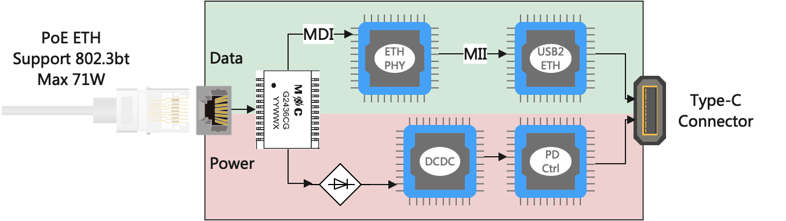

# PoE_Adapter

## The Idea

## Requirements

* Support 802.3af, at, bt
* Maximum PoE input 71W
* Support 10M/100M/1G Ethernet, 2.5G or 10G better
* Support USB PD 60W(20V-3A) or higher, max to 65W
* Support USB PD 2.0 or higher, PPS support is better

## Related Knowledge

### About PoE

[什么是Power over Ethernet（PoE）? 它是如何工作的？ - 华为](https://info.support.huawei.com/info-finder/encyclopedia/zh/PoE.html)

[Power over Ethernet - Wikipedia](https://en.wikipedia.org/wiki/Power_over_Ethernet)

[【全系列】电源大咖课终极篇：EMC/功率隔离/PoE/LTspice_哔哩哔哩_bilibili](https://www.bilibili.com/video/BV1U54y167iA?p=6&vd_source=4a5614e8aaa017dad2b9a475db5972fe)

### About DCDC

### About USB2ETH

## Key Components

* [ ] 网口变压器
* [ ] PoE Interface IC
* [ ] ETH PHY Chip, MDI/MDIX to SGMII
* [ ] DCDC
* [ ] PD Control IC
* [ ] USB2ETH IC

## Possible Test Equipments

### PSE Devices

[HUAWEI ****AD-560161T0E POE++ Injector****](https://www.notion.so/HUAWEI-AD-560161T0E-POE-Injector-f2f963361bf641c6bf67e5bd52b6a7db)

[**Cudy POE400 90W Gigabit Ultra PoE++ Injector Adapter**](https://www.notion.so/Cudy-POE400-90W-Gigabit-Ultra-PoE-Injector-Adapter-ba70eb35d22a4e3bbaf1a9ec274cac1c)

[H3C S5130S-10MS-UPWR-EI Switch](https://www.notion.so/H3C-S5130S-10MS-UPWR-EI-Switch-632d7c23edca47faa28a7068c8aec5ac)

[QNAP ****QSW-M2116P-2T2S Switch****](https://www.notion.so/QNAP-QSW-M2116P-2T2S-Switch-efeddbc0777d48369dd353b2ddde7140)
